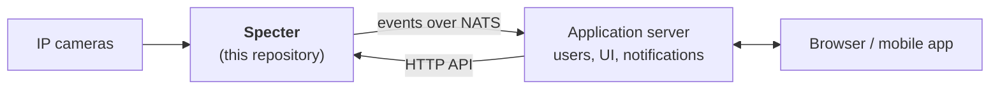

# Specter

Real-time multi-camera edge vision engine. Specter reads camera streams on a device, detects and
identifies people and objects (face recognition, appearance re-identification, zone and line
rules), and raises **alerts** with a snapshot as evidence.

Specter is the vision engine only. It has no user interface and no user accounts: an **application
server** in front of it owns the users and talks to Specter through an HTTP API and NATS events.

## Documentation

| I want to… | Read |
|---|---|
| **Integrate an application with Specter** (start here if you write the app side) | [App integration guide](docs/integration/app-integration-guide.md) |
| Understand how the parts fit together | [Architecture](docs/architecture.md) (diagrams) |
| Look up an HTTP endpoint | [HTTP API reference](docs/integration/http-api.md) |
| Look up a NATS subject or message | [NATS events reference](docs/integration/nats-events.md) |
| Show live video | [Live video](docs/integration/live-video.md) |
| Run, update or troubleshoot a device | [Deployment](docs/deployment.md) |
| Get message schemas | [`contracts/jsonschema/`](contracts/jsonschema/) |

## How it fits together



Both the HTTP API and NATS listen on `127.0.0.1`, so the application server runs on the same device.
The full picture, with every process and flow, is in [Architecture](docs/architecture.md).

## Run it locally

Requirements: Docker. (Python and [uv](https://docs.astral.sh/uv/) are needed only to work on the code.)

```bash
make models     # once: export and download the AI models (takes a while)
make up         # build the image and start everything in Docker
```

That starts the API, the camera manager and the detector, next to NATS, Qdrant and go2rtc, and
restarts any of them if it crashes. Then:

- API docs: <http://127.0.0.1:8000/docs>
- API token: `make api-token`
- `make status`, `make logs`, and `make down` (stops everything, keeps data)

How the containers fit together, hardware profiles and troubleshooting are in
[Deployment](docs/deployment.md).

**Working on the code?** Run the processes from source instead: `make setup` once, then
`make run-all` (`Ctrl+C` stops them; the token is in `.dev/secrets/api.token`). Or one per terminal:
`make services-up`, `make run-api`, `make run-camera-manager`, `make run-detector`. Do not run this
and `make up` together, because they use the same ports. `make help` lists every target.

## Processes

| Process | Command | Job |
|---|---|---|
| `api` | `specter api` | HTTP API for the application server |
| `camera-manager` | `specter camera-manager` | Runs one process per camera, records alerts |
| `camera` | `specter camera --camera-id <id>` | Analyzes one camera (started by the camera manager) |
| `detector` | `specter detector` | Serves the models to all cameras and enrolls reference photos |

`specter migrate` applies database migrations. Every process takes `--config <file>` or reads
`$SPECTER_CONFIG_FILE`; see [`config/specter.example.yaml`](config/specter.example.yaml).

## Repository layout

| Path | Contents |
|---|---|
| `src/specter/api` | HTTP API (FastAPI) |
| `src/specter/camera`, `camera_manager`, `detector` | The three kinds of long-running processes |
| `src/specter/vision` | Sampling, tracking, rules, identity matching |
| `src/specter/inference` | Model runtimes (ONNX Runtime, NCNN) and the models themselves |
| `src/specter/messaging` | NATS subjects, streams and message contracts |
| `src/specter/storage`, `entities` | Database and vector index, and the domain model |
| `src/specter/frame_transport` | How camera processes hand frames to the detector |
| `contracts/jsonschema` | JSON Schema of every published message (`make contracts`) |
| `deploy/` | Dockerfile, Docker Compose (Specter, NATS, Qdrant, go2rtc), and the model export |
| `config/` | Example and development settings |
| `tests/` | `unit`, `integration` (real services), `models` (real models) |

## Development

```bash
make check              # lint, type-check and unit tests
make test-integration   # against real NATS, Qdrant and FFmpeg
make contracts          # regenerate contracts/jsonschema after changing a message
```
