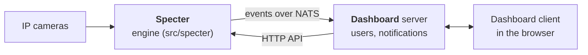

# Specter

Real-time multi-camera edge vision system. **Specter**, the engine, reads camera streams on a
device, detects and identifies people and objects (face recognition, appearance re-identification,
zone and line rules), and raises **alerts** with a snapshot as evidence. The **dashboard**
([`dashboard/`](dashboard/)) is the web application in front of it: users, cameras, watchlists,
alerts and live video.

## Run it

Everything runs in Docker; the machine needs only Docker and git.

```bash
git clone --recurse-submodules <repository-url> && cd Specter
make models     # once: export and download the AI models (takes a while)
make up         # first run: creates .env, then stops and names what to fill in
```

Fill in `SUPABASE_URL` and `SUPABASE_KEY` in `.env` (every other setting has a default, explained
in [`.env.example`](.env.example)), then run `make up` again. It builds the images, starts every
container and waits until each one is healthy. Then open **<http://localhost:8080>**.

| Command | What it does |
|---|---|
| `make up` | Build and start everything; safe to run again, also after `git pull` |
| `make status` | State of every container |
| `make logs` | Follow every container's log |
| `make down` | Stop everything; data is kept in Docker volumes |

Every container restarts by itself when it crashes and when the machine reboots. To run the
engine, the server or the client on their own, from source, see [Running](docs/running.md).

## Documentation

| I want to… | Read |
|---|---|
| **Integrate an application with Specter** (start here if you write the app side) | [App integration guide](docs/integration/app-integration-guide.md) |
| Run the engine, the server or the client on their own | [Running](docs/running.md) |
| Understand how the parts fit together | [Architecture](docs/architecture.md) (diagrams) |
| Look up an HTTP endpoint | [HTTP API reference](docs/integration/http-api.md) |
| Look up a NATS subject or message | [NATS events reference](docs/integration/nats-events.md) |
| Show live video | [Live video](docs/integration/live-video.md) |
| Run, update or troubleshoot a device | [Deployment](docs/deployment.md) |
| Get message schemas | [`contracts/jsonschema/`](contracts/jsonschema/) |

## How it fits together


```mermaid
flowchart LR
    CAM["IP cameras"] --> S["<b>Specter</b><br/>engine (src/specter)"]
    APP["<b>Dashboard</b> server<br/>users, notifications"] -- "HTTP API" --> S
    S -- "events over NATS" --> APP
    APP <--> UI["Dashboard client<br/>in the browser"]
```

Specter's HTTP API and NATS listen on `127.0.0.1` only, so the application server runs on the
same device.
The full picture, with every process and flow, is in [Architecture](docs/architecture.md).

## Processes

| Process | Command | Job |
|---|---|---|
| `api` | `specter api` | HTTP API for the application server |
| `camera-manager` | `specter camera-manager` | Runs one process per camera, records alerts |
| `camera` | `specter camera --camera-id <id>` | Analyzes one camera (started by the camera manager) |
| `detector` | `specter detector` | Serves the models to all cameras and enrolls reference photos |

`specter migrate` applies database migrations. Every setting comes from the root `.env`; see
[`.env.example`](.env.example).

## Repository layout

| Path | Contents |
|---|---|
| `src/specter/api` | HTTP API (FastAPI) |
| `src/specter/camera`, `camera_manager`, `detector` | The three kinds of long-running processes |
| `src/specter/vision` | Sampling, tracking, rules, identity matching |
| `src/specter/inference` | Model runtimes (ONNX Runtime, NCNN) and the models themselves |
| `src/specter/messaging` | NATS subjects, streams and message contracts |
| `src/specter/storage`, `entities` | Database and vector index, and the domain model |
| `src/specter/frame_transport` | How camera processes hand frames to the detector |
| `contracts/jsonschema` | JSON Schema of every published message (`make contracts`) |
| `deploy/` | Dockerfiles (`specter`, `dashboard`), Docker Compose (Specter, NATS, Qdrant, go2rtc, dashboard), and the model export |
| `config/` | `specter.dev.yaml`: service addresses and paths for the engine run from source |
| `scripts/` | `prepare-environment.sh`: what `make up` checks and creates before starting |
| `tests/` | `unit`, `integration` (real services), `models` (real models) |
| `dashboard/` | Web UI and application server ([specter-dashboard](https://github.com/r-el/specter-dashboard)) |

## Development

`make setup` once, then `make check` before pushing; `make help` lists every target.

```bash
make check                      # lint, type-check and unit tests
make contracts                  # regenerate contracts/ after changing a message or an endpoint
uv run pytest -m integration    # against real NATS, Qdrant and FFmpeg
uv run pytest -m models         # against the real models (needs make models)
```
