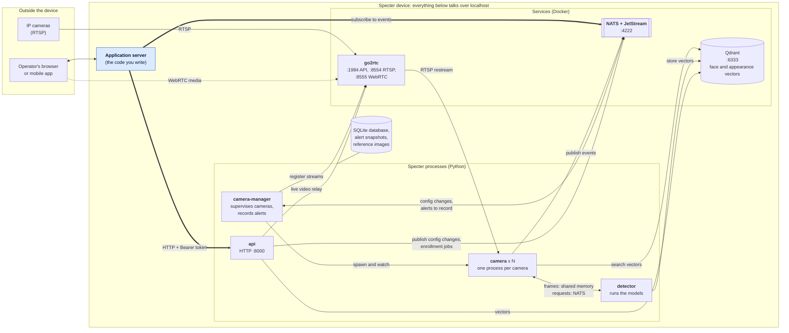
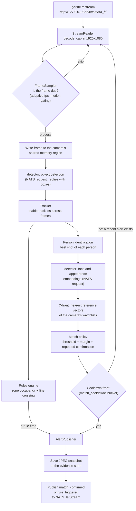
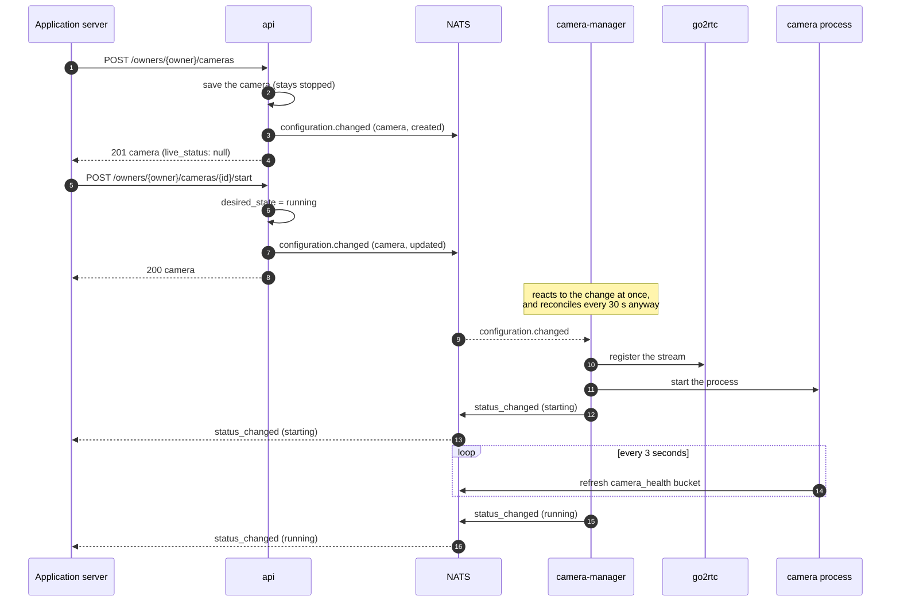
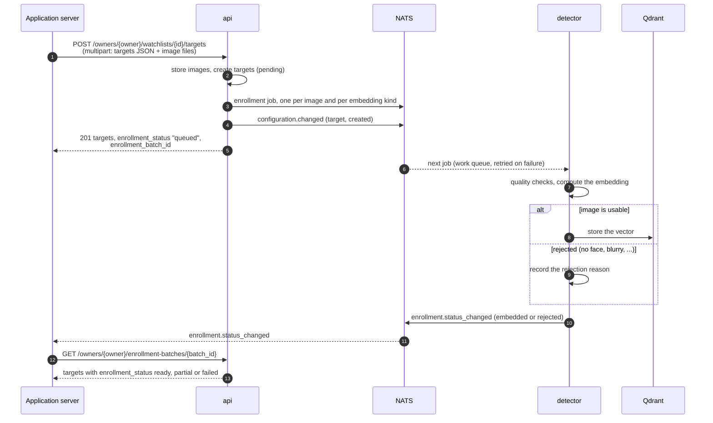
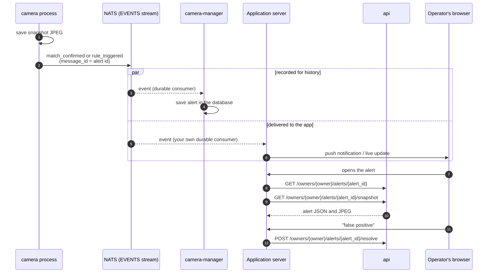
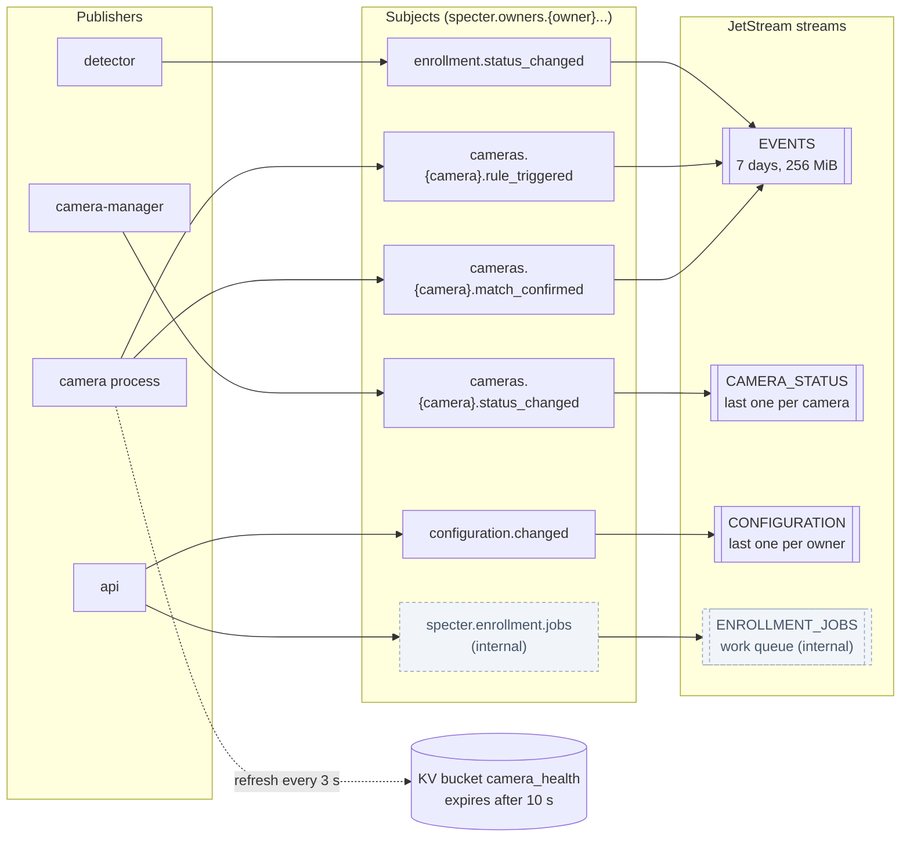
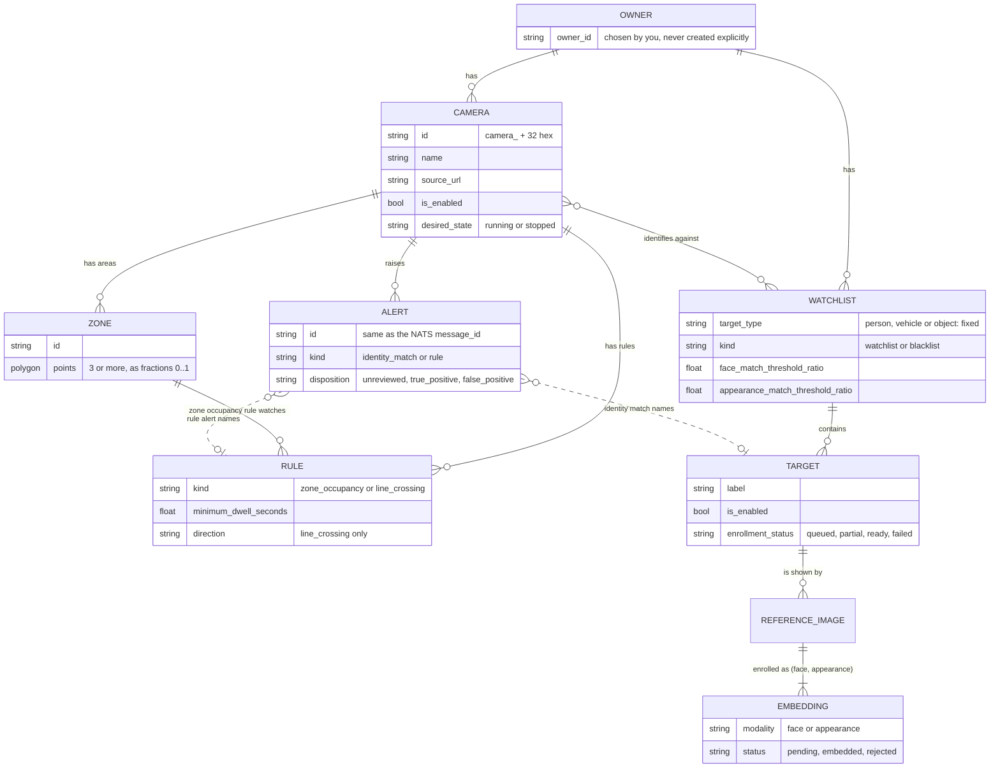

# Specter architecture

Specter is the vision engine of the system. It reads camera streams, detects and identifies people
and objects, and turns what it sees into **alerts**. It has no user interface and no user accounts:
an **application server** sits in front of it, owns the users, and talks to Specter in exactly two
ways:

- an **HTTP API** for everything you *ask for or change* (cameras, zones, rules, watchlists,
  targets, reviewing alerts, live video);
- **NATS** for everything that *happens* (a match, a fired rule, a camera changing status, an
  enrollment finishing).

## 1. The big picture

What matters for you:

| You do | Through | Notes |
|---|---|---|
| Create or change cameras, zones, rules, watchlists, targets | `api` (HTTP) | Every change is announced on NATS so the running processes pick it up. |
| Learn that something happened | NATS | Alerts, camera status, enrollment results. |
| Show live video | `api` (HTTP and WebSocket) | The API relays go2rtc, so go2rtc itself never needs to be exposed. |
| Authenticate your users | **You** | Specter has one service token. It knows *owners*, not users. See [owners](integration/app-integration-guide.md#owners-and-isolation). |

## 2. The processes

| Process | Command | Job |
|---|---|---|
| `api` | `specter api` | Serves the HTTP API. Validates requests, stores changes, announces them on NATS. |
| `camera-manager` | `specter camera-manager` | Starts one `camera` process per camera that should run, restarts it if it dies or freezes, registers the camera's stream in go2rtc, publishes the camera's status, and **records every alert event into the database**. Also deletes old evidence. |
| `camera` | `specter camera --camera-id <id>` | Reads one camera, decides which frames to analyze, tracks objects, applies rules, identifies people, and publishes alert events. The camera manager starts it; you never do. |
| `detector` | `specter detector` | Serves the AI models to every camera process, and enrolls reference images (turns a photo into vectors). |

The services next to them (`deploy/compose.base.yaml`) all listen on `127.0.0.1`, except go2rtc's
WebRTC media port (`8555`), which viewers on the network must be able to reach.

## 3. What happens to a frame

Two consequences for the application:

- An alert is **only as fast as the pipeline**: expect the event a moment after the person is
  confirmed, not instantly.
- The same target on the same camera raises **at most one identity-match alert per cooldown**
  (30 seconds by default). Do not treat a missing second alert as a bug.

## 4. Flows you will implement

### 4.1 Adding a camera and starting it

A successful `start` means *"the camera manager was asked"*, not *"the camera is running"*. Watch
`status_changed` (or read `live_status` on the camera) to know when it actually is.

### 4.2 Adding targets with reference photos

Enrollment is asynchronous. The `201` response only says the photos were accepted; whether a face
was found is decided later by the detector. Show the batch as "processing" until the events say
otherwise.

### 4.3 An alert reaches the operator

The event carries everything needed for a notification. The **snapshot and the review state** come
from the API, because the recorder saves the alert a moment after the event is published. If the
first `GET` returns `404`, retry after a short delay.

## 5. NATS at a glance

Full reference: [NATS events](integration/nats-events.md).

The application server should consume `EVENTS`, `CAMERA_STATUS` and (optionally) `CONFIGURATION`, and
watch `camera_health`. It must **not** touch the `ENROLLMENT_JOBS` stream or the `specter.detector.*`
subjects: they are Specter's internal plumbing.

## 6. Data model

Things that follow from this model:

- **Alerts outlive what raised them.** Deleting a target, watchlist or camera keeps its alerts, so
  an alert can reference an id that no longer exists. Deleting the *owner* removes everything.
- **Zones, rules and coordinates are fractions of the frame** (0 to 1 from the top-left), never
  pixels, so they do not depend on the camera's resolution.
- A watchlist's **target type cannot change** after creation.

## 7. Where things live on disk

Paths are the same inside every container. In Docker they are volumes; from source they are under
`.dev/`. See [Deployment](deployment.md).

| What | Path (Docker / from source) |
|---|---|
| Static settings | environment variables in `deploy/compose.yaml` / `config/specter.dev.yaml` |
| Database, snapshots, reference images | volume `specter-data` at `/var/lib/specter` / `.dev/data` |
| API token and camera credentials key | volume `specter-secrets` at `/etc/specter` / `.dev/secrets` |
| AI models | `./models` at `/opt/specter/models` / `./models` |
| Frames shared between camera processes and the detector | volume `specter-frames` (memory) at `/dev/shm` |
| Message contracts (JSON Schema) | `contracts/jsonschema/` |
