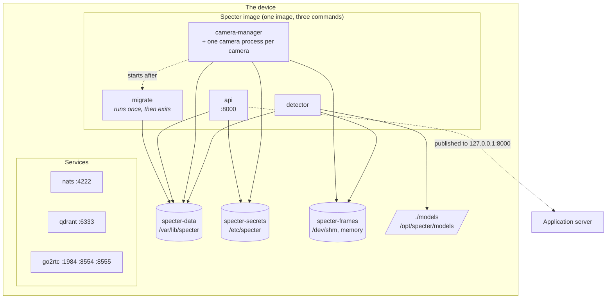

# Deployment

Specter runs as a set of containers: its own three processes, next to NATS, Qdrant and go2rtc. This
page explains how they fit together, so you can run, update and troubleshoot a device.

```bash
make models     # once: export and download the AI models
make up         # build the image and start everything (safe to run again)
make status     # state of every container
make logs       # follow every container's log
make api-token  # print the API token
make down       # stop everything; data is kept
```

`make up` uses two Compose files together: [`deploy/compose.base.yaml`](../deploy/compose.base.yaml)
(NATS, Qdrant, go2rtc) and [`deploy/compose.yaml`](../deploy/compose.yaml) (Specter). To work on
Specter's code without rebuilding an image, run the processes from source instead (`make run-all`,
see the [README](../README.md#run-it-locally)). Use one way or the other, not both at once: they use
the same ports.

## Containers



| Container | Command | Notes |
|---|---|---|
| `migrate` | `specter migrate` | Applies database migrations, then exits. The others wait for it to succeed. |
| `api` | `specter api` | Published on `127.0.0.1:8000` only. Health check: `GET /health`. |
| `camera-manager` | `specter camera-manager` | Also runs every camera process, as its children. Has a 30 second stop time so cameras can stop cleanly. |
| `detector` | `specter detector` | Loads the models when it starts, which takes a few seconds. |
| `nats`, `qdrant`, `go2rtc` | | From `compose.base.yaml`. Published on `127.0.0.1`, except go2rtc's WebRTC port `8555`. |

All Specter containers use `restart: unless-stopped`, so a crashed process comes back by itself, and
so does the whole set after the device reboots (once Docker starts). The processes also reconnect to
NATS on their own, so the start order is forgiving. Qdrant has no health check, so a detector that
starts a moment before it is ready stops and is started again.

## Volumes and paths

| Volume | Mounted at | Holds | Shared by |
|---|---|---|---|
| `specter-data` | `/var/lib/specter` | The SQLite database, alert snapshots, reference photos | every Specter container |
| `specter-secrets` | `/etc/specter` | The key that encrypts camera passwords (and, from source, the API token) | `api`, `camera-manager` |
| `deploy/secrets/api.token` (a file) | `/run/secrets/specter_api_token` | The API token, as a Compose secret. Mount the same file into the application server. | `api` |
| `specter-frames` | `/dev/shm` | Video frames handed from camera processes to the detector (memory only) | `camera-manager`, `detector` |
| `./models` (a folder) | `/opt/specter/models` | The AI models, from `make models` | `detector` |

- **Back up `specter-data` and `specter-secrets` together.** Camera passwords in the database can
  only be decrypted with the key in `specter-secrets`. The database alone is not enough to restore.
- **The API token file** is created by `make api-token-file` (run by `make up`) in a directory only
  its owner can enter. The file itself is readable by every uid, because the API and the
  application server run as different users. Without `make` (Windows), create it by hand:

  ```powershell
  New-Item -ItemType Directory -Force deploy/secrets | Out-Null
  [Convert]::ToBase64String([Security.Cryptography.RandomNumberGenerator]::GetBytes(32)).TrimEnd('=').Replace('+','-').Replace('/','_') | Set-Content -NoNewline deploy/secrets/api.token
  ```

  Upgrading from a version that kept the token in `specter-secrets`: to keep the old token, copy it
  first with `docker compose -f deploy/compose.base.yaml -f deploy/compose.yaml exec -T api cat /etc/specter/api.token > deploy/secrets/api.token`.
- **WebRTC viewers** get the addresses in `GO2RTC_WEBRTC_CANDIDATES` (see
  [Live video](integration/live-video.md#3-webrtc-post-webrtc)). Set it to the device's LAN address
  and port 8555 for viewers on the local network.
- The database is a **named volume on purpose**. SQLite's write-ahead log needs a real local
  filesystem, and a bind mount from a Mac or a network share can break its locking.
- The models folder is **not read-only**: the detector downloads published models that are missing,
  and works in a temporary folder there. On Linux the folder must be writable by the container's
  user, which has uid `10001`:

  ```bash
  sudo chown -R 10001 models
  ```

- `docker compose down` keeps volumes. `down -v` deletes them, **including NATS and Qdrant data**.
  Do not use `-v` unless you mean to erase the device.

## Shared frames

A camera process does not send a frame to the detector: it writes it into POSIX shared memory
(`/dev/shm`) and sends a short request over NATS that names the region. The detector reads the frame
from the same memory. This is fast, and it is why the camera manager and the detector must see the
**same `/dev/shm`**.

`specter-frames` is a tmpfs volume mounted at `/dev/shm` in both containers. Two consequences:

- **Size.** A 1080p frame takes about 6 MiB per camera. Docker's default `/dev/shm` is 64 MiB, which
  would fit only a handful of cameras, so the volume is 1 GiB. Memory is used only for frames that
  exist. Change `size=` in `deploy/compose.yaml` for very many cameras.
- **Why not share the container's IPC namespace** (`ipc: service:camera-manager`)? It looks simpler,
  but when the camera manager restarts, the detector keeps looking at the old, empty `/dev/shm`.
  Analysis silently stops while every camera still reports `running`. A volume outlives container
  restarts. If you ever see a detector idle while cameras run, check that
  `docker compose exec detector ls /dev/shm` lists the same regions as the camera manager.

## Hardware profiles

The hardware profile picks which models run and how. It is set with environment variables that the
compose file reads:

| Variable | Default | Meaning |
|---|---|---|
| `SPECTER_HARDWARE_PROFILE` | `pc-cpu` | `pc-cpu`, `pc-nvidia`, `jetson` or `raspberry-pi` |
| `SPECTER_EXTRA` | `onnxruntime` | Which runtime is installed in the image: `onnxruntime`, or `ncnn` for `raspberry-pi` |

```bash
SPECTER_HARDWARE_PROFILE=raspberry-pi SPECTER_EXTRA=ncnn make up
```

The image is CPU-only. `pc-nvidia` and `jetson` need a CUDA-capable base image and the NVIDIA
container runtime, which this repository does not provide yet (the base is the `PYTHON_IMAGE`
argument of [`deploy/Dockerfile`](../deploy/Dockerfile)). Any other setting can be overridden the
same way as the ones in `compose.yaml`: an environment variable named `SPECTER_<SECTION>__<FIELD>`,
for example `SPECTER_MATCHING__COOLDOWN_SECONDS=60` (see
[`config/specter.example.yaml`](../config/specter.example.yaml) for every setting).

## Updating

```bash
git pull
make models     # only if the model manifest changed
make up         # rebuilds the image and recreates the containers that changed
```

Migrations run automatically, first, through the `migrate` container. Data volumes are untouched.

## Troubleshooting

| Symptom | Check |
|---|---|
| `detector` keeps restarting | `make logs`. `model file … is missing or damaged`: run `make models` for this profile. `Read-only file system` or `Permission denied` under `/opt/specter/models`: the folder must be writable (see above). |
| Camera says `running` but nothing is ever detected | The detector and camera manager may not share `/dev/shm`. Compare `ls /dev/shm` in both (see above). |
| `api` unhealthy | `curl -s http://127.0.0.1:8000/health`. `"is_nats_connected": false` means NATS is not reachable yet. |
| Port already in use | Something else uses 8000, 4222, 6333, 1984, 8554 or 8555. Often `make run-all` is still running. |
| The API token changed | In Docker it is `deploy/secrets/api.token`, created once by `make api-token-file`. A new value means that file was deleted; restart the application server with the new one. |
| `secret "specter_api_token" file … not found` | Run `make api-token-file` (or `make up`, which runs it). |
