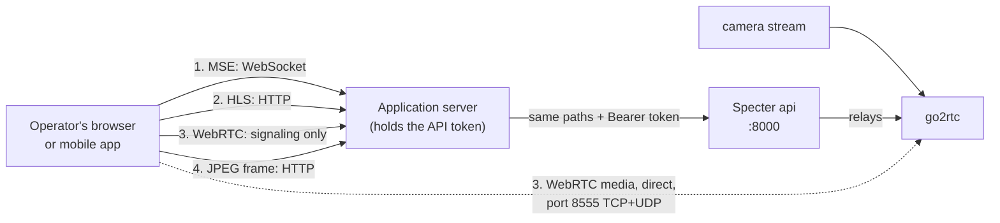

# Live video

Specter can show what a camera sees right now. The video is **relayed by the API**, so go2rtc (the
media server behind it) never has to be reachable from outside the device, with one exception:
WebRTC media.

Live video is separate from analysis. Watching a camera does not change what Specter detects, and a
camera is analyzed whether or not anyone watches.

## Four ways to watch

| | Delay | Works in | Media path | Choose it for |
|---|---|---|---|---|
| **MSE** (WebSocket) | Low | Most browsers. Not iPhone Safari. | Through the API | The default live view on desktop and Android. |
| **HLS** | Several seconds | Everywhere, including iPhone Safari | Through the API | Browsers without MSE, or when a few seconds of delay is fine. |
| **WebRTC** | Lowest | Everywhere | **Directly from go2rtc to the viewer** | Real-time viewing, when the viewer can reach port 8555. |
| **JPEG frame** | One request per image | Everywhere | Through the API | Thumbnails, "last seen" previews, polling a snapshot every second or two. |

All four require the camera to be **started** (`desired_state` `running`). Otherwise the API answers
`409` (or closes the WebSocket with code `1008`).

## The application server is the relay

Browsers **cannot send an `Authorization` header** on a WebSocket, and the API token must never
reach a browser. So the browser never talks to Specter. It talks to the application server, which:

1. checks that the logged-in user may see this camera,
2. maps it to `{owner_id, camera_id}`,
3. opens the matching Specter URL **with the bearer token**, and
4. pipes bytes both ways.

Every path below is under `/owners/{owner}/cameras/{camera}/live`.

### 1. MSE over WebSocket: `WS /mse`

`ws://127.0.0.1:8000/owners/{owner}/cameras/{camera}/live/mse`, with the header
`Authorization: Bearer <token>` on the upgrade request.

The API relays [go2rtc's MSE WebSocket](https://github.com/AlexxIT/go2rtc) unchanged, so the
protocol is go2rtc's:

1. The browser sends a text message naming the codecs its player supports:
   `{"type":"mse","value":"avc1.640029,avc1.64002a,mp4a.40.2"}`.
2. go2rtc replies with a text message holding the MIME type to open a `SourceBuffer` with, then
3. streams **binary** messages of fragmented MP4 that you append to that `SourceBuffer`.

The application server forwards text and binary frames in both directions and closes one side when
the other closes. Close codes you may see from Specter: `1008` (bad token, unknown camera, or
camera not started) and `1011` (go2rtc unavailable).

### 2. HLS: `GET /stream.m3u8` and `GET /hls/{file}`

`stream.m3u8` returns a playlist whose links are **relative** and point at `hls/…`. Serve the playlist
and forward every `GET …/live/hls/{file}` under the same prefix, adding the bearer token on each
request. Only the file names `playlist.m3u8`, `segment.ts`, `init.mp4` and `segment.m4s` are
relayed (anything else is `404`), and query strings are passed through. Use the player's own
plumbing (for example a custom loader in hls.js), or a path prefix on your proxy, so the relative
links resolve through your server.

### 3. WebRTC: `POST /webrtc`

Only the **negotiation** goes through the API:

- Send the browser's SDP offer as the request body with `Content-Type: application/sdp`.
- The response body is the SDP answer, also `application/sdp`.

The video then flows **directly between go2rtc and the viewer** on port **8555** (TCP and UDP),
which the Docker Compose file publishes on all interfaces. Consequences:

- The viewer's network must be able to reach the device on 8555. Viewers outside the local network
  need that port forwarded or otherwise routed.
- go2rtc is not configured with a fixed public address, so it advertises the device's own
  addresses. If viewers reach the device through NAT or a different address, set go2rtc's
  `webrtc.candidates` (in `deploy/go2rtc/go2rtc.yaml`) to the address they use. This is a
  deployment decision, not something the API can do for you.
- Fall back to MSE or HLS when the WebRTC connection does not establish.

### 4. JPEG frame: `GET /frame.jpeg`

Returns the latest frame as `image/jpeg`. Cheap and simple, and independent of any player. Poll it
for previews. For a smooth picture use one of the streaming options instead.

## Failures

| Situation | HTTP | WebSocket |
|---|---|---|
| Missing or wrong token | `401` | closed with `1008` |
| Camera does not exist, or belongs to another owner | `404` | closed with `1008` |
| Camera not started | `409` | closed with `1008` |
| Camera started but go2rtc has no stream yet, or go2rtc is down | `503` | closed with `1011` |

Right after `start`, the camera manager still has to register the stream in go2rtc, so the first
attempt can fail with `503`. Wait for `status_changed` to `running` (or `live_status`), or retry with
a short delay.
