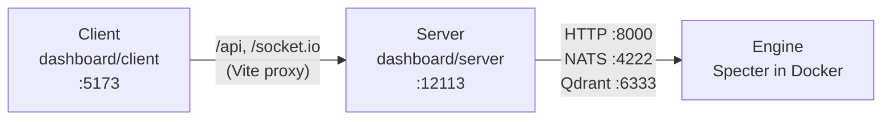

# Running each part on its own

The usual way to run the system is `make up`, which runs everything in Docker (see the
[README](../README.md#run-it)). This guide is for working on one part: it runs the engine, the
server and the client separately, the server and the client from source.



Start them in this order, each in its own terminal: the engine, then the server, then the client.
Stop `make up` first (`make down`): its dashboard container would compete with the server run from
source for the same events.

Requirements: Docker, git and Node ≥ 22.

## Configuration: one `.env`

Every part reads the root `.env`, the same file `make up` uses, and nothing else: each command
below loads it explicitly. The first `make engine-up` creates it from
[`.env.example`](../.env.example), with a generated `JWT_SECRET`, and creates the API token in
`deploy/secrets/api.token`. Fill in `SUPABASE_URL` and `SUPABASE_KEY` before starting the server.

`.env.example` lists every setting, commented out with its default; uncomment a line only to change
it. Addresses between the parts are not settings and are not in `.env`: the Compose files wire them
in Docker, and [`config/specter.dev.yaml`](../config/specter.dev.yaml) for the engine run from
source.

## Engine (Specter)

```bash
make engine-up    # NATS, Qdrant, go2rtc and Specter's processes, in Docker
```

It is ready when `curl -s http://127.0.0.1:8000/health` answers `"status":"ok"`. `make status`,
`make logs` and `make down` work as with `make up`. How the containers fit together, hardware
profiles and troubleshooting are in [Deployment](deployment.md).

### From source, to work on the engine's code

`make setup` once. Start the services in Docker, then one Specter process per terminal:

```bash
docker compose --env-file .env -f deploy/compose.infra.yaml up -d   # NATS, Qdrant, go2rtc
uv run --env-file .env specter --config config/specter.dev.yaml migrate
uv run --env-file .env specter --config config/specter.dev.yaml api   # then camera-manager, detector
```

The token is then `.dev/secrets/api.token` and the data is in `.dev/`; the server finds that token
by itself. Nothing restarts a process that crashes this way. Do not run this and
`make engine-up` together: they use the same ports.

## Server (dashboard/server)

```bash
cd dashboard/server
npm ci            # after every change to package-lock.json
npx tsx watch --env-file=../../.env -r tsconfig-paths/register index.ts   # restarts on changes
```

This is the server's `npm run dev` with the root `.env` loaded. Plain `npm run dev` reads
`dashboard/server/.env` instead, a second copy of the settings: do not keep one.

It listens on `http://localhost:12113` and is ready when
`curl -s http://localhost:12113/api/health` answers `"success":true`; that also means it reached
the engine's API and NATS. API documentation: <http://localhost:12113/api-docs>.

It finds the API token by itself: `.dev/secrets/api.token` once the engine has run from source,
otherwise `deploy/secrets/api.token`. If both exist and the engine runs in Docker, set
`SPECTER_API_TOKEN_FILE=../../deploy/secrets/api.token` in `.env`.

## Client (dashboard/client)

```bash
cd dashboard/client
npm ci
npm run dev       # hot reload
```

Open <http://localhost:5173>. The client needs no configuration: Vite forwards `/api` and
`/socket.io` to the server on port 12113.

## Submodules

`dashboard/` is a submodule, and so are `dashboard/server` and `dashboard/client` inside it. Each
is checked out at the commit this repository records, not at the tip of its branch:

```bash
git submodule update --init --recursive   # a clone made without --recurse-submodules
git pull --recurse-submodules             # update Specter and the recorded dashboard commits
```

To work on the dashboard, commit inside `dashboard/server` or `dashboard/client` on a branch of
their own, then commit the new submodule pointer in Specter. `git submodule update --remote`
moves a submodule to the tip of its branch instead; use it only to adopt newer dashboard commits
on purpose, and commit the result.

## Tests

```bash
make check                              # engine: lint, types and unit tests
cd dashboard/server && npm run test     # server
cd dashboard/client && npm run test     # client
```
