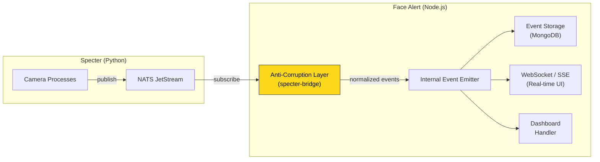

# תכנון אינטגרציה: Face Alert ↔ Specter

## הבעיה
פרויקט **Face Alert (fa)** צריך לצרוך נתונים מ-**Specter** (התראות זיהוי, סטטוס מצלמות, שינויי תצורה), אבל Specter:
- עדיין בפיתוח אקטיבי ע"י חבר צוות אחר
- עלול לשנות סכימת הודעות, להוסיף subjects חדשים, לשנות API
- כתוב בפייתון – שפה שונה מ-fa

**המטרה**: חיבור שמקיים עקרונות SOLID, מינימום Coupling, ושעמיד לשינויים ב-Specter.

## ניתוח המצב הנוכחי

### מה Specter חושף כלפי חוץ (ה"חוזה")
Specter כבר מפרסם חוזים רשמיים בתיקיית [`contracts/jsonschema/`](file:///c:/Users/ATanami/Documents/Specter/contracts/jsonschema):

| הודעה | NATS Subject Pattern | תיאור |
|---|---|---|
| `MatchConfirmedMessage` | `specter.owners.{owner}.cameras.{cam}.match_confirmed` | זיהוי חיובי של מטרה |
| `RuleTriggeredMessage` | `specter.owners.{owner}.cameras.{cam}.rule_triggered` | חוק הופעל (חציית קו / נוכחות באזור) |
| `CameraStatusChangedMessage` | `specter.owners.{owner}.cameras.{cam}.status_changed` | שינוי סטטוס מצלמה |
| `EnrollmentStatusChangedMessage` | `specter.owners.{owner}.enrollment.status_changed` | עדכון סטטוס הרשמת תמונה |
| `ConfigurationChangedMessage` | `specter.owners.{owner}.configuration.changed` | שינוי ישות (מצלמה/חוק/רשימה/יעד) |
| `CameraHealthReport` | KV bucket `camera_health` | דו"ח בריאות מצלמה (TTL 10s) |

> [!IMPORTANT]
> ל-Specter יש `schema_version: "1.0"` בכל הודעה. זה ה-Anchor שלנו – כל עוד הגרסה לא עולה, המבנה לא ישבור לנו דברים.

### מה fa עושה היום
- מונגו כמאגר אירועים (קולקציית `Event` עם `person_id`, `camera_id`, `level`, `image_id`)
- Supabase למשתמשים ומצלמות
- MinIO/GridFS לתמונות

---

## ארכיטקטורת אינטגרציה מוצעת



### עקרון מפתח: Anti-Corruption Layer (ACL)

**שכבת תרגום** שיושבת בין NATS (ה-Specter) לבין הלוגיקה הפנימית של fa. אף חלק בקוד fa מעבר ל-ACL לא מכיר את מבנה ההודעות של Specter. אם Specter משנה את המבנה – רק ה-ACL צריך להשתנות.

---

## הצעת מבנה קבצים

```
server/src/
├── specter-bridge/            # ← ה-ACL — נקודת המגע היחידה עם Specter
│   ├── index.ts               # ייצוא ציבורי (Facade)
│   ├── natsClient.ts          # חיבור ל-NATS, subscribe, reconnect
│   ├── messageParser.ts       # פרסור הודעות Specter → טיפוסים פנימיים (Zod)
│   ├── subjectPatterns.ts     # NATS subject patterns (wildcard matching)
│   ├── specterSchemas.ts      # Zod schemas שנגזרים מה-JSON Schema contracts
│   └── contracts/             # עותק / סימלינק של contracts/jsonschema מ-Specter
│       ├── match_confirmed.schema.json
│       ├── rule_triggered.schema.json
│       └── ...
│
├── @types/
│   └── specterEvents.ts       # טיפוסי fa הפנימיים (FaMatchEvent, FaRuleEvent...)
│
├── events/
│   ├── eventModel.ts          # ← ללא שינוי (עובד עם המודל הפנימי)
│   ├── eventService.ts        # ← ללא שינוי (עובד עם המודל הפנימי)
│   └── ...
```

---

## עקרונות SOLID שמנחים את התכנון

### S — Single Responsibility
| רכיב | אחריות בודדת |
|---|---|
| `natsClient.ts` | חיבור/ניתוק/reconnect ל-NATS בלבד |
| `messageParser.ts` | תרגום הודעת Specter → מודל פנימי של fa |
| `specterSchemas.ts` | ולידציה בלבד (Zod schemas מבוססי contract) |
| `EventService` (קיים) | לוגיקה עסקית של אירועים — לא מכיר Specter |

### O — Open/Closed
- מוסיפים סוג הודעה חדש מ-Specter? → מוסיפים handler חדש ב-`messageParser.ts`, בלי לשנות קוד קיים.
- `natsClient` מקבל רשימה של handlers דרך Registry pattern.

### L — Liskov Substitution
- כל handler מממש את אותו ממשק (`ISpecterMessageHandler`), כך שהמערכת מתייחסת אליהם באופן אחיד.

### I — Interface Segregation
- ה-ACL חושף ל-fa רק ממשק צר: `subscribe()`, `unsubscribe()`, `getConnectionStatus()`.
- שאר הקוד ב-fa לא רואה NATS, לא רואה Pydantic schemas, לא רואה subjects.

### D — Dependency Inversion
- `EventService` תלוי בממשק `IEventSource`, לא ב-`NatsClient` ישירות.
- בטסטים ניתן להחליף ל-`MockEventSource`.

---

## הצעת ממשקים וטיפוסים

### 1. טיפוסים פנימיים (מה ש-fa מכיר)

```typescript
// @types/specterEvents.ts — הטיפוסים של fa, לא של Specter

export interface FaMatchEvent {
  specterMessageId: string;
  cameraId: string;
  targetId: string;
  watchlistId: string;
  similarityRatio: number;
  objectClass: string;
  boundingBox: { x: number; y: number; width: number; height: number };
  capturedAt: Date;
  snapshotUrl: string | null;
}

export interface FaRuleEvent {
  specterMessageId: string;
  cameraId: string;
  ruleId: string;
  ruleKind: "zone_occupancy" | "line_crossing";
  objectClass: string;
  boundingBox: { x: number; y: number; width: number; height: number };
  dwellSeconds: number | null;
  crossingDirection: string | null;
  capturedAt: Date;
  snapshotUrl: string | null;
}

export interface FaCameraStatus {
  cameraId: string;
  status: "starting" | "running" | "reconnecting" | "stopped" | "failed";
  detail: string | null;
  reportedAt: Date;
}

export type FaSpecterEvent = FaMatchEvent | FaRuleEvent | FaCameraStatus;
```

### 2. ממשק ה-ACL (מה שה-fa Service Layer רואה)

```typescript
// specter-bridge/index.ts

export interface ISpecterBridge {
  connect(): Promise<void>;
  disconnect(): Promise<void>;
  isConnected(): boolean;

  onMatchConfirmed(handler: (event: FaMatchEvent) => Promise<void>): void;
  onRuleTriggered(handler: (event: FaRuleEvent) => Promise<void>): void;
  onCameraStatusChanged(handler: (status: FaCameraStatus) => Promise<void>): void;
}
```

### 3. Registry Pattern (Open/Closed)

```typescript
// specter-bridge/messageParser.ts

type MessageTransformer<T> = (raw: unknown) => T;

const transformerRegistry = new Map<string, MessageTransformer<FaSpecterEvent>>();

// Registration — add new ones without modifying existing code
transformerRegistry.set("match_confirmed", transformMatchConfirmed);
transformerRegistry.set("rule_triggered", transformRuleTriggered);
transformerRegistry.set("status_changed", transformCameraStatus);
```

---

## שלבי ביצוע מוצעים

### Phase 1: תשתית NATS Client (בלי לשנות קוד קיים)
- [ ] התקנת `nats` npm package
- [ ] יצירת `specter-bridge/natsClient.ts` עם reconnect + health check
- [ ] יצירת `specter-bridge/specterSchemas.ts` — Zod schemas מבוססי JSON Schema contracts
- [ ] הוספת הגדרות `NATS_URL` ל-`.env`

### Phase 2: Anti-Corruption Layer
- [ ] יצירת הטיפוסים הפנימיים (`@types/specterEvents.ts`)
- [ ] יצירת `messageParser.ts` — transformer registry + validation
- [ ] יצירת `specter-bridge/index.ts` — Facade שמייצא `ISpecterBridge`

### Phase 3: חיווט לשכבה העסקית הקיימת
- [ ] שמירת אירועי Specter לקולקציית `Event` ב-MongoDB (מיפוי MatchConfirmed → IEvent)
- [ ] עדכון `dashboardRoutes.ts` לחשוף נתונים מבוססי Specter
- [ ] הוספת Health endpoint שמשקף גם את מצב ה-NATS

### Phase 4: Real-time (אופציונלי)
- [ ] WebSocket/SSE endpoint שמעביר אירועי Specter בזמן אמת ל-Client

---

## כיצד מתמודדים עם שינויים ב-Specter

| סוג שינוי ב-Specter | השפעה על fa |
|---|---|
| **הוספת שדה חדש להודעה** | אפס – Zod schema עם `passthrough()` מתעלם משדות לא מוכרים |
| **שינוי שם שדה קיים** | רק `messageParser.ts` צריך לעדכן את ה-transformer |
| **הוספת סוג הודעה חדש** | מוסיפים transformer חדש ב-Registry, בלי לשנות קוד קיים |
| **שינוי schema_version ל-2.0** | ה-ACL בודק version ומחליט אם לפרסר עם transformer ישן או חדש |
| **שינוי NATS subject pattern** | רק `subjectPatterns.ts` צריך עדכון |

> [!WARNING]
> **חשוב**: יש לדאוג לעדכן את קבצי ה-`contracts/` בתוך fa בכל פעם שחבר הצוות משחרר גרסה חדשה. מומלץ לעשות זאת כ-Git Submodule או סקריפט העתקה אוטומטי.

---

## שאלות פתוחות

> [!IMPORTANT]
> 1. **מי ה-`owner_id`?** — כל הודעה ב-Specter מכילה `owner_id`. האם fa צריך לתמוך במספר owners, או שזה תמיד יהיה owner יחיד (tenant אחד)?
> 2. **Snapshot URL** — ב-`MatchConfirmedMessage` יש `snapshot_url`. האם fa ישמור את התמונה למונגו GridFS/MinIO, או יקשר ל-URL שSpecter חושף?
> 3. **מיפוי `camera_id`** — ב-Specter ל-`camera_id` יש פורמט מסוים (string UUID-like). ב-fa ה-`camera_id` הוא שדה טקסט חופשי. צריך להחליט: האם נשתמש ב-ID של Specter כ-source of truth, או שנשמור מיפוי (mapping table)?
> 4. **NATS בייצור** — האם שרת NATS כבר רץ בסביבת הייצור? או שצריך להוסיף אותו ל-`docker-compose.yml`?
