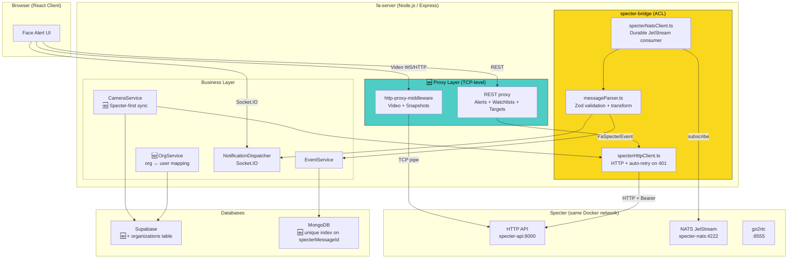
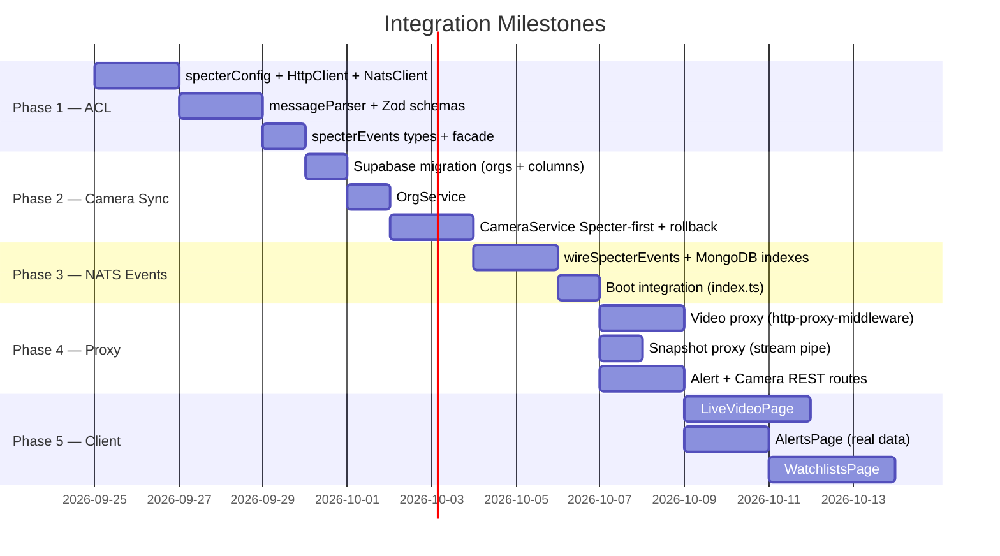

# תכנון אינטגרציה מלאה: Face Alert ↔ Specter (v2 — מעודכן)

## מטרה
אינטגרציה מלאה של **Face Alert (fa)** עם **Specter**, כך ש-fa יצרוך התראות, יעקוב אחרי מצלמות, ינהל watchlists/targets דרך ה-HTTP API של Specter, ויציג וידאו חי — הכול דרך Anti-Corruption Layer (ACL).

> [!NOTE]
> **מסמך זה הוא v2** — שילוב התכנון המקורי עם שיפורי אמינות וביצועים. שינויים מהתכנון הקודם מסומנים ב-🆕.

---

## החלטות שהתקבלו

| שאלה | החלטה | נימוק |
|---|---|---|
| **Owner strategy** | 🆕 `org_{org_id}` | Future-proof — מאפשר שיתוף מצלמות בין משתמשים באותו ארגון |
| **Snapshot URL** | Proxy streaming דרך fa-server | 🆕 Pipe ישיר ללא טעינה לזיכרון |
| **Camera creation order** | 🆕 Specter קודם → Supabase → rollback on failure | מונע "זומבים" ב-Supabase |
| **Docker topology** | 🆕 fa-server ב-Docker, אותו network של Specter | `http://specter-api:8000` + `nats://specter-nats:4222` |
| **Migrations** | 🆕 Supabase CLI | `supabase migration new ...` |
| **Video proxy** | 🆕 `http-proxy-middleware` ברמת TCP | מונע bottleneck ב-JS event loop |

---

## ארכיטקטורה (מעודכנת)



---

## מבנה קבצים

```
server/src/
├── specter-bridge/                    # ACL — נקודת מגע יחידה עם Specter
│   ├── index.ts                       # Facade: exports + wireSpecterEvents
│   ├── specterHttpClient.ts           # 🆕 HTTP client with 401 auto-refresh
│   ├── specterNatsClient.ts           # JetStream durable consumer
│   ├── messageParser.ts              # Zod validation + transform registry
│   ├── subjectPatterns.ts             # NATS subject constants
│   ├── specterSchemas.ts              # Zod schemas from contracts/jsonschema/
│   ├── specterConfig.ts               # Config (API URL, token file, NATS, owner)
│   ├── wireSpecterEvents.ts           # 🆕 Wires parsed events → MongoDB + Socket.IO
│   └── tokens.ts                      # DI tokens
│
├── @types/
│   ├── interfaces.ts                  # existing + 🆕 specter_camera_id, org_id
│   └── specterEvents.ts              # [NEW] fa internal event types
│
├── organizations/                     # 🆕 [NEW] Organization management
│   ├── organizationModel.ts           # Supabase CRUD for organizations table
│   ├── organizationService.ts         # org ↔ user mapping, owner_id resolution
│   └── organizationRoutes.ts          # Admin: create/list/assign users to org
│
├── specter-proxy/                     # 🆕 [NEW] TCP-level proxy routes
│   ├── videoProxy.ts                  # http-proxy-middleware for MSE/HLS/JPEG/WebRTC
│   ├── snapshotProxy.ts              # Stream pipe for alert snapshots
│   └── middleware.ts                 # resolveCamera, resolveOwner helpers
│
├── specter-routes/                    # [NEW] REST proxy routes
│   ├── alertRoutes.ts                 # List, acknowledge, resolve
│   ├── watchlistRoutes.ts             # CRUD watchlists
│   ├── targetRoutes.ts               # CRUD targets + multipart upload
│   └── specterCameraRoutes.ts        # Create/start/stop (Specter-first sync)
│
├── cameras/                           # existing, enhanced
│   ├── cameraModel.ts                 # 🆕 + specter_camera_id, specter_owner_id
│   ├── cameraService.ts              # 🆕 Specter-first creation with rollback
│   └── ...
│
├── events/
│   ├── eventModel.ts                  # 🆕 + unique index on specterMessageId
│   └── ...
│
├── notifications/
│   ├── types.ts                       # 🆕 + IdentityMatchNotification, RuleAlertNotification
│   └── ...
│
├── core/
│   ├── di.ts                          # 🆕 + SpecterHttpClient, OrgService
│   └── ...
│
└── server.ts                          # 🆕 mount proxy + specter routes
```

---

## Phase 1: ACL Foundation — `specter-bridge`

### [NEW] `specterConfig.ts`
```typescript
export const specterConfig = {
  apiUrl: process.env.SPECTER_API_URL ?? "http://specter-api:8000",
  apiTokenFile: process.env.SPECTER_API_TOKEN_FILE ?? "/etc/specter/api.token",
  natsUrl: process.env.NATS_URL ?? "nats://specter-nats:4222",
  consumerName: "facealert_alerts",
} as const;
```

### [NEW] `specterHttpClient.ts` — 🆕 עם auto-refresh on 401

```typescript
import { readFile } from "node:fs/promises";
import logger from "@core/utils/logger.js";
import { specterConfig } from "./specterConfig.js";

export class SpecterApiError extends Error {
  constructor(public status: number, public detail: unknown) {
    super(`Specter ${status}: ${JSON.stringify(detail)}`);
  }
}

export class SpecterHttpClient {
  private token: string | null = null;

  /** Read the token from file. Caches until invalidated. */
  private async getToken(): Promise<string> {
    if (!this.token) {
      this.token = (await readFile(specterConfig.apiTokenFile, "utf8")).trim();
      logger.info("Specter API token loaded from file");
    }
    return this.token;
  }

  /** 🆕 Clear cached token — forces re-read from file on next request. */
  private invalidateToken(): void {
    this.token = null;
    logger.warn("Specter API token cache cleared (will re-read from file)");
  }

  /**
   * Call the Specter API with automatic retry on 401 (token rotation).
   * 🆕 If a 401 is received, the token cache is cleared and the request
   * is retried once with a fresh token read from disk.
   */
  async request<T>(path: string, opts: { method?: string; body?: unknown } = {}): Promise<T> {
    const doRequest = async (): Promise<Response> => {
      const token = await this.getToken();
      const headers: Record<string, string> = { Authorization: `Bearer ${token}` };
      let payload: BodyInit | undefined;

      if (opts.body instanceof FormData) {
        payload = opts.body;
      } else if (opts.body !== undefined) {
        headers["Content-Type"] = "application/json";
        payload = JSON.stringify(opts.body);
      }

      return fetch(`${specterConfig.apiUrl}${path}`, {
        method: opts.method ?? "GET",
        headers,
        body: payload,
      });
    };

    let resp = await doRequest();

    // 🆕 Auto-refresh: if 401, the token may have been rotated on disk
    if (resp.status === 401) {
      logger.warn("Specter returned 401 — refreshing token and retrying");
      this.invalidateToken();
      resp = await doRequest();
    }

    if (!resp.ok) {
      throw new SpecterApiError(resp.status, await resp.json().catch(() => null));
    }

    return resp.status === 204 ? (undefined as T) : ((await resp.json()) as T);
  }

  /** 🆕 Proxy a raw response (for snapshots) — returns the upstream Response for piping. */
  async proxyRaw(path: string): Promise<Response> {
    const token = await this.getToken();
    const resp = await fetch(`${specterConfig.apiUrl}${path}`, {
      headers: { Authorization: `Bearer ${token}` },
    });
    if (resp.status === 401) {
      this.invalidateToken();
      const newToken = await this.getToken();
      return fetch(`${specterConfig.apiUrl}${path}`, {
        headers: { Authorization: `Bearer ${newToken}` },
      });
    }
    return resp;
  }

  // ── Typed helpers (examples) ──

  async createCamera(ownerId: string, body: {
    name: string;
    source_url: string;
    credentials?: { username: string; password: string };
    watchlist_ids?: string[];
    detection_classes?: string[];
  }) {
    return this.request<{ id: string; owner_id: string }>(`/owners/${ownerId}/cameras`, {
      method: "POST", body,
    });
  }

  async deleteCamera(ownerId: string, cameraId: string) {
    return this.request<void>(`/owners/${ownerId}/cameras/${cameraId}`, { method: "DELETE" });
  }

  async startCamera(ownerId: string, cameraId: string) {
    return this.request<void>(`/owners/${ownerId}/cameras/${cameraId}/start`, { method: "POST" });
  }

  async stopCamera(ownerId: string, cameraId: string) {
    return this.request<void>(`/owners/${ownerId}/cameras/${cameraId}/stop`, { method: "POST" });
  }

  async listCameras(ownerId: string) {
    return this.request<any[]>(`/owners/${ownerId}/cameras`);
  }

  async createWatchlist(ownerId: string, body: {
    name: string;
    target_type: "person" | "vehicle" | "object";
    kind?: "watchlist" | "blacklist";
  }) {
    return this.request<{ id: string }>(`/owners/${ownerId}/watchlists`, { method: "POST", body });
  }

  async listIdentityMatches(ownerId: string, query?: Record<string, string>) {
    const qs = query ? "?" + new URLSearchParams(query).toString() : "";
    return this.request<{ alerts: any[]; next_cursor: string | null }>(
      `/owners/${ownerId}/alerts/identity-matches${qs}`
    );
  }

  async listRuleAlerts(ownerId: string, query?: Record<string, string>) {
    const qs = query ? "?" + new URLSearchParams(query).toString() : "";
    return this.request<{ alerts: any[]; next_cursor: string | null }>(
      `/owners/${ownerId}/alerts/rules${qs}`
    );
  }

  async acknowledgeAlert(ownerId: string, alertId: string) {
    return this.request<any>(`/owners/${ownerId}/alerts/${alertId}/acknowledge`, { method: "POST" });
  }

  async resolveAlert(ownerId: string, alertId: string, body: {
    disposition: "true_positive" | "false_positive";
    note?: string;
  }) {
    return this.request<any>(`/owners/${ownerId}/alerts/${alertId}/resolve`, { method: "POST", body });
  }
}
```

### [NEW] `specterNatsClient.ts`

```typescript
import { connect, type NatsConnection } from "@nats-io/transport-node";
import { AckPolicy, DeliverPolicy, jetstream, jetstreamManager, type Consumer } from "@nats-io/jetstream";
import logger from "@core/utils/logger.js";
import { specterConfig } from "./specterConfig.js";
import { parseSpecterMessage } from "./messageParser.js";
import type { FaSpecterEvent } from "~types/specterEvents.js";

export class SpecterNatsClient {
  private nc: NatsConnection | null = null;
  private handlers: ((event: FaSpecterEvent, rawSubject: string) => Promise<void>)[] = [];

  onEvent(handler: (event: FaSpecterEvent, subject: string) => Promise<void>): void {
    this.handlers.push(handler);
  }

  async connect(): Promise<void> {
    this.nc = await connect({
      servers: specterConfig.natsUrl,
      name: "facealert-server",
      maxReconnectAttempts: -1,
    });

    logger.info("Connected to NATS", { server: specterConfig.natsUrl });

    // Create/reuse durable consumer
    const jsm = await jetstreamManager(this.nc);
    await jsm.consumers.add("EVENTS", {
      durable_name: specterConfig.consumerName,
      ack_policy: AckPolicy.Explicit,
      deliver_policy: DeliverPolicy.New,
      filter_subjects: [
        "specter.owners.*.cameras.*.match_confirmed",
        "specter.owners.*.cameras.*.rule_triggered",
        "specter.owners.*.enrollment.status_changed",
      ],
    });

    const consumer = await jetstream(this.nc).consumers.get("EVENTS", specterConfig.consumerName);
    this.consumeLoop(consumer);
  }

  private async consumeLoop(consumer: Consumer): Promise<void> {
    for await (const msg of await consumer.consume()) {
      try {
        const parsed = parseSpecterMessage(msg.subject, msg.json());
        if (parsed) {
          for (const handler of this.handlers) {
            await handler(parsed, msg.subject);
          }
        }
        msg.ack();
      } catch (err) {
        logger.error("Failed to handle Specter message", { subject: msg.subject, err });
        msg.nak(5_000); // retry in 5s
      }
    }
  }

  async disconnect(): Promise<void> {
    await this.nc?.drain();
    logger.info("Disconnected from NATS");
  }

  isConnected(): boolean {
    return this.nc !== null && !this.nc.isClosed();
  }
}
```

### [NEW] `@types/specterEvents.ts`

```typescript
/** ── Identity Match (from match_confirmed) ── */
export interface FaMatchEvent {
  readonly kind: "identity_match";
  readonly specterMessageId: string;
  readonly ownerId: string;
  readonly cameraId: string;
  readonly targetId: string;
  readonly watchlistId: string;
  readonly modality: "face" | "appearance";
  readonly similarityRatio: number;
  readonly marginRatio: number;
  readonly thresholdRatio: number;
  readonly objectClass: string;
  readonly boundingBox: { x: number; y: number; width: number; height: number };
  readonly capturedAt: Date;
  readonly occurredAt: Date;
}

/** ── Rule Alert (from rule_triggered) ── */
export interface FaRuleEvent {
  readonly kind: "rule_alert";
  readonly specterMessageId: string;
  readonly ownerId: string;
  readonly cameraId: string;
  readonly ruleId: string;
  readonly ruleKind: "zone_occupancy" | "line_crossing";
  readonly objectClass: string;
  readonly boundingBox: { x: number; y: number; width: number; height: number };
  readonly dwellSeconds: number | null;
  readonly crossingDirection: "left_to_right" | "right_to_left" | null;
  readonly capturedAt: Date;
  readonly occurredAt: Date;
}

/** ── Camera Status (from status_changed) ── */
export interface FaCameraStatus {
  readonly kind: "camera_status";
  readonly specterMessageId: string;
  readonly cameraId: string;
  readonly ownerId: string;
  readonly status: "starting" | "running" | "reconnecting" | "stopped" | "failed";
  readonly occurredAt: Date;
}

/** ── Enrollment Status (from enrollment.status_changed) ── */
export interface FaEnrollmentStatus {
  readonly kind: "enrollment_status";
  readonly specterMessageId: string;
  readonly ownerId: string;
  readonly targetId: string;
  readonly referenceImageId: string;
  readonly modality: "face" | "appearance";
  readonly status: "embedded" | "rejected";
  readonly rejectionReason: string | null;
  readonly qualityScoreRatio: number | null;
}

export type FaSpecterEvent = FaMatchEvent | FaRuleEvent | FaCameraStatus | FaEnrollmentStatus;
```

### [NEW] `messageParser.ts` — Zod validation + transform registry

```typescript
import { z } from "zod";
import logger from "@core/utils/logger.js";
import type {
  FaMatchEvent, FaRuleEvent, FaCameraStatus, FaEnrollmentStatus, FaSpecterEvent,
} from "~types/specterEvents.js";

// ── Common envelope (passthrough for forward-compatibility) ──
const boundingBoxSchema = z.object({
  x: z.number(), y: z.number(), width: z.number(), height: z.number(),
});

const envelope = z.object({
  schema_version: z.string(),
  message_id: z.string(),
  occurred_at: z.string(),
  owner_id: z.string(),
}).passthrough();

// ── match_confirmed ──
const matchSchema = envelope.extend({
  camera_id: z.string(),
  track_id: z.number().int(),
  watchlist_id: z.string(),
  target_id: z.string(),
  modality: z.enum(["face", "appearance"]),
  similarity_ratio: z.number(),
  margin_ratio: z.number(),
  threshold_ratio: z.number(),
  object_class: z.string(),
  bounding_box: boundingBoxSchema,
  frame_captured_at: z.string(),
  snapshot_path: z.string().nullable().optional(),
});

function transformMatch(raw: z.infer<typeof matchSchema>): FaMatchEvent {
  return {
    kind: "identity_match",
    specterMessageId: raw.message_id,
    ownerId: raw.owner_id,
    cameraId: raw.camera_id,
    targetId: raw.target_id,
    watchlistId: raw.watchlist_id,
    modality: raw.modality,
    similarityRatio: raw.similarity_ratio,
    marginRatio: raw.margin_ratio,
    thresholdRatio: raw.threshold_ratio,
    objectClass: raw.object_class,
    boundingBox: raw.bounding_box,
    capturedAt: new Date(raw.frame_captured_at),
    occurredAt: new Date(raw.occurred_at),
  };
}

// ── rule_triggered ──
const ruleSchema = envelope.extend({
  camera_id: z.string(),
  rule_id: z.string(),
  rule_kind: z.enum(["zone_occupancy", "line_crossing"]),
  zone_id: z.string().nullable().optional(),
  track_id: z.number().int(),
  object_class: z.string(),
  bounding_box: boundingBoxSchema,
  dwell_seconds: z.number().nullable().optional(),
  crossing_direction: z.enum(["left_to_right", "right_to_left"]).nullable().optional(),
  frame_captured_at: z.string(),
  snapshot_path: z.string().nullable().optional(),
});

function transformRule(raw: z.infer<typeof ruleSchema>): FaRuleEvent {
  return {
    kind: "rule_alert",
    specterMessageId: raw.message_id,
    ownerId: raw.owner_id,
    cameraId: raw.camera_id,
    ruleId: raw.rule_id,
    ruleKind: raw.rule_kind,
    objectClass: raw.object_class,
    boundingBox: raw.bounding_box,
    dwellSeconds: raw.dwell_seconds ?? null,
    crossingDirection: raw.crossing_direction ?? null,
    capturedAt: new Date(raw.frame_captured_at),
    occurredAt: new Date(raw.occurred_at),
  };
}

// ── status_changed ──
const statusSchema = envelope.extend({
  camera_id: z.string(),
  status: z.enum(["starting", "running", "reconnecting", "stopped", "failed"]),
});

function transformStatus(raw: z.infer<typeof statusSchema>): FaCameraStatus {
  return {
    kind: "camera_status",
    specterMessageId: raw.message_id,
    cameraId: raw.camera_id,
    ownerId: raw.owner_id,
    status: raw.status,
    occurredAt: new Date(raw.occurred_at),
  };
}

// ── enrollment.status_changed ──
const enrollmentSchema = envelope.extend({
  target_id: z.string(),
  reference_image_id: z.string(),
  modality: z.enum(["face", "appearance"]),
  status: z.enum(["embedded", "rejected"]),
  rejection_reason: z.string().nullable().optional(),
  quality_score_ratio: z.number().nullable().optional(),
});

function transformEnrollment(raw: z.infer<typeof enrollmentSchema>): FaEnrollmentStatus {
  return {
    kind: "enrollment_status",
    specterMessageId: raw.message_id,
    ownerId: raw.owner_id,
    targetId: raw.target_id,
    referenceImageId: raw.reference_image_id,
    modality: raw.modality,
    status: raw.status,
    rejectionReason: raw.rejection_reason ?? null,
    qualityScoreRatio: raw.quality_score_ratio ?? null,
  };
}

// ── Registry ──
type SubjectSuffix = string;
const registry = new Map<SubjectSuffix, { schema: z.ZodSchema; transform: (raw: any) => FaSpecterEvent }>([
  ["match_confirmed", { schema: matchSchema, transform: transformMatch }],
  ["rule_triggered",  { schema: ruleSchema,  transform: transformRule }],
  ["status_changed",  { schema: statusSchema, transform: transformStatus }],
  ["enrollment.status_changed", { schema: enrollmentSchema, transform: transformEnrollment }],
]);

/**
 * Extract the message type suffix from a NATS subject.
 * Examples:
 *   specter.owners.acme.cameras.camera_4f9c.match_confirmed → match_confirmed
 *   specter.owners.acme.enrollment.status_changed → enrollment.status_changed
 */
function extractSuffix(subject: string): string {
  if (subject.endsWith(".enrollment.status_changed")) return "enrollment.status_changed";
  const parts = subject.split(".");
  return parts[parts.length - 1]; // match_confirmed | rule_triggered | status_changed
}

/** Parse and validate a raw Specter message, returning an fa-internal event or null. */
export function parseSpecterMessage(subject: string, raw: unknown): FaSpecterEvent | null {
  // 🆕 Check major schema_version before parsing
  const envelope = raw as { schema_version?: string };
  if (envelope.schema_version && !envelope.schema_version.startsWith("1.")) {
    logger.warn("Unsupported schema_version, skipping", { subject, version: envelope.schema_version });
    return null;
  }

  const suffix = extractSuffix(subject);
  const entry = registry.get(suffix);
  if (!entry) {
    logger.debug("Unknown Specter message type (ignored)", { subject, suffix });
    return null;
  }

  const result = entry.schema.safeParse(raw);
  if (!result.success) {
    logger.error("Specter message validation failed", { subject, errors: result.error.issues });
    return null;
  }

  return entry.transform(result.data);
}
```

### Dependencies (Phase 1)
```bash
cd integrations/fa/server
npm install @nats-io/transport-node @nats-io/jetstream @nats-io/kv
npm install http-proxy-middleware  # for Phase 4 video proxy
```

### Environment variables (`.env.example` additions)
```env
# Specter Integration
SPECTER_API_URL=http://specter-api:8000        # Docker internal DNS
SPECTER_API_TOKEN_FILE=/etc/specter/api.token
NATS_URL=nats://specter-nats:4222              # Docker internal DNS
```

---

## Phase 2: Camera Sync + Organizations 🆕

### 🆕 [NEW] Supabase Migration: `organizations` table + camera columns

```sql
-- supabase/migrations/20260924_add_specter_integration.sql

-- Organizations table (for owner_id isolation in Specter)
CREATE TABLE IF NOT EXISTS organizations (
  id UUID PRIMARY KEY DEFAULT gen_random_uuid(),
  name TEXT NOT NULL,
  specter_owner_id TEXT NOT NULL UNIQUE,  -- e.g. "org_abc123"
  created_at TIMESTAMPTZ DEFAULT now(),
  updated_at TIMESTAMPTZ DEFAULT now()
);

-- Link users to organizations (many-to-many)
CREATE TABLE IF NOT EXISTS user_organizations (
  id UUID PRIMARY KEY DEFAULT gen_random_uuid(),
  user_id UUID NOT NULL REFERENCES users(id) ON DELETE CASCADE,
  organization_id UUID NOT NULL REFERENCES organizations(id) ON DELETE CASCADE,
  role TEXT NOT NULL DEFAULT 'member',  -- 'owner', 'admin', 'member'
  created_at TIMESTAMPTZ DEFAULT now(),
  UNIQUE(user_id, organization_id)
);

-- Add Specter columns to cameras
ALTER TABLE cameras
  ADD COLUMN IF NOT EXISTS specter_camera_id TEXT DEFAULT NULL,
  ADD COLUMN IF NOT EXISTS organization_id UUID REFERENCES organizations(id);

-- Default organization for existing data
INSERT INTO organizations (name, specter_owner_id)
VALUES ('Default', 'org_default')
ON CONFLICT (specter_owner_id) DO NOTHING;

-- Indexes
CREATE INDEX IF NOT EXISTS idx_cameras_specter_id ON cameras(specter_camera_id);
CREATE INDEX IF NOT EXISTS idx_cameras_org_id ON cameras(organization_id);
CREATE INDEX IF NOT EXISTS idx_user_org_user ON user_organizations(user_id);
CREATE INDEX IF NOT EXISTS idx_user_org_org ON user_organizations(organization_id);
```

### 🆕 [NEW] `organizations/organizationService.ts`

```typescript
import { getSupabaseClient } from "@core/db/supabase.js";
import { injectable } from "tsyringe";

@injectable()
export class OrgService {
  private supabase = getSupabaseClient();

  /** Resolve the Specter owner_id for a user (from their organization). */
  async getSpecterOwnerIdForUser(userId: string): Promise<string> {
    const { data, error } = await this.supabase
      .from("user_organizations")
      .select("organizations(specter_owner_id)")
      .eq("user_id", userId)
      .limit(1)
      .single();

    if (error || !data) throw new Error("User has no organization assigned");
    return (data as any).organizations.specter_owner_id;
  }

  /** Create an organization with an auto-generated specter_owner_id. */
  async createOrg(name: string): Promise<{ id: string; specter_owner_id: string }> {
    const specterId = `org_${crypto.randomUUID().replace(/-/g, "").slice(0, 16)}`;
    const { data, error } = await this.supabase
      .from("organizations")
      .insert({ name, specter_owner_id: specterId })
      .select()
      .single();
    if (error) throw new Error(`Failed to create organization: ${error.message}`);
    return data;
  }

  /** Assign user to organization. */
  async assignUserToOrg(userId: string, orgId: string, role = "member") {
    const { error } = await this.supabase
      .from("user_organizations")
      .insert({ user_id: userId, organization_id: orgId, role });
    if (error) throw new Error(`Failed to assign user: ${error.message}`);
  }
}
```

### [MODIFY] `cameraService.ts` — 🆕 Specter-first creation with rollback

```diff
  import { Camera } from "./cameraModel.js";
  import { inject, injectable } from "tsyringe";
+ import { SpecterHttpClient } from "@specter-bridge/specterHttpClient.js";
+ import { OrgService } from "@organizations/organizationService.js";
+ import { SPECTER_HTTP_CLIENT } from "@specter-bridge/tokens.js";

  @injectable()
  export class CameraService {
    constructor(
      @inject(CAMERA_REPOSITORY) private readonly cameraRepository: CameraRepository,
+     @inject(SPECTER_HTTP_CLIENT) private readonly specterClient: SpecterHttpClient,
+     private readonly orgService: OrgService,
    ) {}

    async createCamera(cameraData, userId, userRole) {
      if (!["operator", "admin"].includes(userRole))
        throw new Error("Insufficient permissions to create camera");

-     try {
-       const camera = await this.cameraRepository.create({ ...cameraData, created_by: userId });
-       return camera;
-     } catch (error) { ... }

+     // 🆕 STEP 1: Create in Specter FIRST (source of truth)
+     const ownerId = await this.orgService.getSpecterOwnerIdForUser(userId);
+     let specterCamera: { id: string } | null = null;
+
+     try {
+       specterCamera = await this.specterClient.createCamera(ownerId, {
+         name: cameraData.name,
+         source_url: cameraData.connection_string,
+       });
+     } catch (err) {
+       logger.error("Failed to create camera in Specter", { err });
+       throw new Error("Failed to register camera with Specter");
+     }
+
+     // 🆕 STEP 2: Create in Supabase with specter_camera_id
+     try {
+       const camera = await this.cameraRepository.create({
+         ...cameraData,
+         created_by: userId,
+         specter_camera_id: specterCamera.id,
+       });
+       return camera;
+     } catch (error) {
+       // 🆕 STEP 3: Rollback Specter on Supabase failure
+       logger.error("Supabase create failed — rolling back Specter camera", {
+         specterCameraId: specterCamera.id,
+       });
+       try {
+         await this.specterClient.deleteCamera(ownerId, specterCamera.id);
+       } catch (rollbackErr) {
+         // 🆕 Double failure: log for manual reconciliation
+         logger.error("CRITICAL: Rollback of Specter camera also failed!", {
+           specterCameraId: specterCamera.id,
+           rollbackErr,
+         });
+       }
+       throw error;
+     }
    }
  }
```

### [MODIFY] `@types/interfaces.ts` — Add new fields

```diff
  export interface ICamera {
    id?: string;
    camera_id: string;
    name: string;
    connection_string: string;
    created_by?: string;
+   specter_camera_id?: string | null;
+   organization_id?: string | null;
    created_at?: Date | string;
    updated_at?: Date | string;
  }
```

---

## Phase 3: NATS → Events + Notifications

### [NEW] `wireSpecterEvents.ts` — 🆕 With idempotent MongoDB storage

```typescript
import logger from "@core/utils/logger.js";
import { getEventsCollection } from "@core/db/mongodb.js";
import { NotificationDispatcher } from "@notifications/notificationDispatcher.js";
import { SpecterNatsClient } from "./specterNatsClient.js";
import type { FaSpecterEvent, FaMatchEvent, FaRuleEvent, FaCameraStatus } from "~types/specterEvents.js";

/**
 * Wire NATS events into MongoDB (storage) and Socket.IO (real-time push).
 * 🆕 Uses upsert with unique index on specterMessageId for idempotency.
 */
export function wireSpecterEvents(
  nats: SpecterNatsClient,
  dispatcher: NotificationDispatcher,
  findFaCameraBySpecterId: (specterCameraId: string) => Promise<{ id: string; name: string } | null>,
) {
  nats.onEvent(async (event: FaSpecterEvent) => {
    switch (event.kind) {
      case "identity_match":
        await handleIdentityMatch(event, dispatcher, findFaCameraBySpecterId);
        break;
      case "rule_alert":
        await handleRuleAlert(event, dispatcher, findFaCameraBySpecterId);
        break;
      case "camera_status":
        await handleCameraStatus(event, dispatcher, findFaCameraBySpecterId);
        break;
      case "enrollment_status":
        logger.info("Enrollment status received", {
          targetId: event.targetId,
          status: event.status,
          modality: event.modality,
        });
        break;
    }
  });
}

async function handleIdentityMatch(
  event: FaMatchEvent,
  dispatcher: NotificationDispatcher,
  findCamera: (id: string) => Promise<{ id: string; name: string } | null>,
) {
  const collection = getEventsCollection();

  // 🆕 Idempotent upsert: if specterMessageId already exists, skip insert
  const result = await collection.updateOne(
    { specterMessageId: event.specterMessageId },
    {
      $setOnInsert: {
        specterMessageId: event.specterMessageId,
        kind: event.kind,
        camera_id: event.cameraId,
        owner_id: event.ownerId,
        target_id: event.targetId,
        watchlist_id: event.watchlistId,
        modality: event.modality,
        similarity_ratio: event.similarityRatio,
        object_class: event.objectClass,
        bounding_box: event.boundingBox,
        captured_at: event.capturedAt,
        occurred_at: event.occurredAt,
        level: event.similarityRatio > 0.7 ? "high" : event.similarityRatio > 0.5 ? "medium" : "low",
        created_at: new Date(),
      },
    },
    { upsert: true },
  );

  // 🆕 Only dispatch notification if this is truly a new event (not a redelivery)
  if (result.upsertedCount === 0) {
    logger.debug("Duplicate Specter event skipped", { messageId: event.specterMessageId });
    return;
  }

  // Find the fa camera for Socket.IO room targeting
  const faCamera = await findCamera(event.cameraId);
  if (faCamera) {
    dispatcher.toCamera(faCamera.id, {
      kind: "unauthorized_person",
      cameraId: faCamera.id,
      cameraName: faCamera.name,
      personId: event.targetId,
      confidence: event.similarityRatio,
      level: event.similarityRatio > 0.7 ? "critical" : "warning",
      snapshotUrl: `/specter/alerts/${event.specterMessageId}/snapshot`,
      timestamp: event.occurredAt.toISOString(),
    });
  }
}

async function handleRuleAlert(
  event: FaRuleEvent,
  dispatcher: NotificationDispatcher,
  findCamera: (id: string) => Promise<{ id: string; name: string } | null>,
) {
  const collection = getEventsCollection();

  const result = await collection.updateOne(
    { specterMessageId: event.specterMessageId },
    {
      $setOnInsert: {
        specterMessageId: event.specterMessageId,
        kind: event.kind,
        camera_id: event.cameraId,
        owner_id: event.ownerId,
        rule_id: event.ruleId,
        rule_kind: event.ruleKind,
        object_class: event.objectClass,
        bounding_box: event.boundingBox,
        dwell_seconds: event.dwellSeconds,
        crossing_direction: event.crossingDirection,
        captured_at: event.capturedAt,
        occurred_at: event.occurredAt,
        level: "medium",
        created_at: new Date(),
      },
    },
    { upsert: true },
  );

  if (result.upsertedCount === 0) return;

  const faCamera = await findCamera(event.cameraId);
  if (faCamera) {
    dispatcher.toCamera(faCamera.id, {
      kind: "camera_status", // reuse existing type or add rule_alert
      cameraId: faCamera.id,
      cameraName: faCamera.name,
      status: "online",
      message: `Rule triggered: ${event.ruleKind} (${event.objectClass})`,
      level: "warning",
      timestamp: event.occurredAt.toISOString(),
    });
  }
}

async function handleCameraStatus(
  event: FaCameraStatus,
  dispatcher: NotificationDispatcher,
  findCamera: (id: string) => Promise<{ id: string; name: string } | null>,
) {
  const faCamera = await findCamera(event.cameraId);
  if (!faCamera) return;

  const statusMap: Record<string, "online" | "offline" | "error"> = {
    starting: "online",
    running: "online",
    reconnecting: "error",
    stopped: "offline",
    failed: "error",
  };

  dispatcher.toCamera(faCamera.id, {
    kind: "camera_status",
    cameraId: faCamera.id,
    cameraName: faCamera.name,
    status: statusMap[event.status] ?? "offline",
    message: `Camera ${event.status}`,
    level: event.status === "failed" ? "critical" : event.status === "reconnecting" ? "warning" : "info",
    timestamp: event.occurredAt.toISOString(),
  });
}
```

### 🆕 MongoDB Unique Index (create on startup)

```typescript
// In mongodb.ts or a separate migration script
async function ensureSpecterIndexes() {
  const events = getEventsCollection();
  await events.createIndex(
    { specterMessageId: 1 },
    { unique: true, sparse: true, name: "idx_specter_message_id" },
  );
  logger.info("MongoDB: ensured unique index on specterMessageId");
}
```

### [MODIFY] `index.ts` — Start NATS client on boot

```diff
  import { initializeSocketServer } from "./notifications/socketServer.js";
+ import { SpecterNatsClient } from "@specter-bridge/specterNatsClient.js";
+ import { wireSpecterEvents } from "@specter-bridge/wireSpecterEvents.js";

  async function startServer() {
    // ... existing MongoDB + Supabase setup ...

    const httpServer = app.listen(PORT, HOST, () => { /* ... */ });
    const dispatcher = initializeSocketServer(httpServer);

+   // 🆕 Connect to Specter NATS (non-blocking — server starts even if Specter is down)
+   try {
+     const natsClient = new SpecterNatsClient();
+     wireSpecterEvents(natsClient, dispatcher, findFaCameraBySpecterId);
+     await natsClient.connect();
+     logger.info("✔ Connected to Specter NATS");
+   } catch (err) {
+     logger.warn("⚠ Specter NATS not available — real-time events disabled", {
+       error: (err as Error).message,
+     });
+   }
  }

+ // Helper: look up fa camera by its Specter camera_id
+ async function findFaCameraBySpecterId(specterCameraId: string) {
+   const supabase = getSupabaseClient();
+   const { data } = await supabase
+     .from("cameras")
+     .select("id, name")
+     .eq("specter_camera_id", specterCameraId)
+     .maybeSingle();
+   return data;
+ }
```

### [MODIFY] `notifications/types.ts` — Add new notification kinds

```diff
+ export interface IdentityMatchNotification {
+   readonly kind: "identity_match";
+   readonly cameraId: string;
+   readonly cameraName: string;
+   readonly targetId: string;
+   readonly targetLabel: string;
+   readonly watchlistName: string;
+   readonly similarity: number;
+   readonly modality: "face" | "appearance";
+   readonly snapshotUrl: string | null;
+   readonly level: NotificationLevel;
+   readonly timestamp: string;
+ }
+
+ export interface RuleAlertNotification {
+   readonly kind: "rule_alert";
+   readonly cameraId: string;
+   readonly cameraName: string;
+   readonly ruleKind: "zone_occupancy" | "line_crossing";
+   readonly objectClass: string;
+   readonly level: NotificationLevel;
+   readonly snapshotUrl: string | null;
+   readonly timestamp: string;
+ }

  export type Notification =
    | UnauthorizedPersonNotification
    | CameraStatusNotification
    | SystemNotification
+   | IdentityMatchNotification
+   | RuleAlertNotification;
```

---

## Phase 4: Proxy Routes — 🆕 TCP-level Video + Streaming Snapshots

### 🆕 [NEW] `specter-proxy/videoProxy.ts` — TCP-level proxy

```typescript
import { createProxyMiddleware, type Options } from "http-proxy-middleware";
import { Router } from "express";
import logger from "@core/utils/logger.js";
import { specterConfig } from "@specter-bridge/specterConfig.js";
import { authenticateToken } from "@core/middlewares/authMiddleware.js";
import { resolveSpecterCamera } from "./middleware.js";

const router = Router();

/**
 * 🆕 TCP-level proxy for all live video paths.
 * Uses http-proxy-middleware to pipe bytes at the socket level,
 * avoiding JS event loop overhead for video frames.
 */
const videoProxyOptions: Options = {
  target: specterConfig.apiUrl,
  changeOrigin: true,
  ws: true,  // WebSocket support for MSE
  on: {
    proxyReq: async (proxyReq, req) => {
      // Inject Specter bearer token
      const token = await getSpecterToken();
      proxyReq.setHeader("Authorization", `Bearer ${token}`);
    },
    error: (err, req, res) => {
      logger.error("Video proxy error", { err: err.message, path: req.url });
      if ("writeHead" in res) {
        (res as any).writeHead(502, { "Content-Type": "application/json" });
        (res as any).end(JSON.stringify({ error: "Video proxy failed" }));
      }
    },
  },
};

// All live video paths under /specter/cameras/:id/live/*
// The middleware rewrites the path to Specter's URL format
router.use(
  "/cameras/:id/live",
  authenticateToken,
  resolveSpecterCamera,  // sets req.specterOwnerId, req.specterCameraId
  (req, _res, next) => {
    // Rewrite path: /specter/cameras/:id/live/... → /owners/{owner}/cameras/{cam}/live/...
    const subPath = req.url; // e.g. /frame.jpeg, /mse, /stream.m3u8
    req.url = `/owners/${(req as any).specterOwnerId}/cameras/${(req as any).specterCameraId}/live${subPath}`;
    next();
  },
  createProxyMiddleware(videoProxyOptions),
);

export default router;
```

### 🆕 [NEW] `specter-proxy/snapshotProxy.ts` — Stream pipe (no buffering)

```typescript
import { Router } from "express";
import { Readable } from "stream";
import { pipeline } from "stream/promises";
import logger from "@core/utils/logger.js";
import { authenticateToken } from "@core/middlewares/authMiddleware.js";
import { container } from "@core/di.js";
import { SpecterHttpClient } from "@specter-bridge/specterHttpClient.js";
import { OrgService } from "@organizations/organizationService.js";

const router = Router();

/**
 * 🆕 Proxy alert snapshots from Specter to browser.
 * Uses stream piping to avoid loading the entire image into memory.
 */
router.get("/alerts/:alertId/snapshot", authenticateToken, async (req: any, res: any) => {
  try {
    const specterClient = container.resolve(SpecterHttpClient);
    const orgService = container.resolve(OrgService);
    const ownerId = await orgService.getSpecterOwnerIdForUser(req.user.id);

    // Fetch from Specter (returns a Response with a readable body)
    const upstream = await specterClient.proxyRaw(
      `/owners/${ownerId}/alerts/${req.params.alertId}/snapshot`
    );

    if (!upstream.ok) {
      return res.status(upstream.status).json({
        error: upstream.status === 404 ? "Snapshot not found" : "Failed to fetch snapshot",
      });
    }

    // 🆕 Stream pipe: Specter → browser, without loading into Node.js memory
    res.status(200);
    res.set("Content-Type", upstream.headers.get("Content-Type") ?? "image/jpeg");
    res.set("Cache-Control", "public, max-age=86400"); // snapshots are immutable

    if (upstream.body) {
      const nodeStream = Readable.fromWeb(upstream.body as any);
      await pipeline(nodeStream, res);
    } else {
      res.end();
    }
  } catch (err: any) {
    logger.error("Snapshot proxy error", { alertId: req.params.alertId, err: err.message });
    if (!res.headersSent) {
      res.status(502).json({ error: "Snapshot proxy failed" });
    }
  }
});

export default router;
```

### [NEW] `specter-proxy/middleware.ts` — Resolve camera helper

```typescript
import { container } from "@core/di.js";
import { OrgService } from "@organizations/organizationService.js";
import { getSupabaseClient } from "@core/db/supabase.js";

/**
 * Express middleware: resolves an fa camera ID to Specter owner_id + camera_id.
 * Sets req.specterOwnerId and req.specterCameraId for downstream handlers.
 */
export async function resolveSpecterCamera(req: any, res: any, next: any) {
  try {
    const orgService = container.resolve(OrgService);
    const ownerId = await orgService.getSpecterOwnerIdForUser(req.user.id);

    const supabase = getSupabaseClient();
    const { data: camera } = await supabase
      .from("cameras")
      .select("specter_camera_id")
      .eq("id", req.params.id)
      .single();

    if (!camera?.specter_camera_id) {
      return res.status(404).json({ error: "Camera not registered with Specter" });
    }

    req.specterOwnerId = ownerId;
    req.specterCameraId = camera.specter_camera_id;
    next();
  } catch (err) {
    res.status(500).json({ error: "Failed to resolve Specter camera" });
  }
}
```

### [NEW] `specter-routes/alertRoutes.ts`

```typescript
import { Router } from "express";
import { authenticateToken } from "@core/middlewares/authMiddleware.js";
import { container } from "@core/di.js";
import { SpecterHttpClient } from "@specter-bridge/specterHttpClient.js";
import { OrgService } from "@organizations/organizationService.js";

const router = Router();

router.get("/alerts/identity-matches", authenticateToken, async (req: any, res: any) => {
  const orgService = container.resolve(OrgService);
  const specterClient = container.resolve(SpecterHttpClient);
  const ownerId = await orgService.getSpecterOwnerIdForUser(req.user.id);

  const query: Record<string, string> = {};
  if (req.query.camera_id) query.camera_id = req.query.camera_id;
  if (req.query.disposition) query.disposition = req.query.disposition;
  if (req.query.limit) query.limit = req.query.limit;
  if (req.query.cursor) query.cursor = req.query.cursor;

  const result = await specterClient.listIdentityMatches(ownerId, query);
  res.json(result);
});

router.get("/alerts/rules", authenticateToken, async (req: any, res: any) => {
  const orgService = container.resolve(OrgService);
  const specterClient = container.resolve(SpecterHttpClient);
  const ownerId = await orgService.getSpecterOwnerIdForUser(req.user.id);

  const query: Record<string, string> = {};
  if (req.query.camera_id) query.camera_id = req.query.camera_id;
  if (req.query.limit) query.limit = req.query.limit;
  if (req.query.cursor) query.cursor = req.query.cursor;

  const result = await specterClient.listRuleAlerts(ownerId, query);
  res.json(result);
});

router.post("/alerts/:id/acknowledge", authenticateToken, async (req: any, res: any) => {
  const orgService = container.resolve(OrgService);
  const specterClient = container.resolve(SpecterHttpClient);
  const ownerId = await orgService.getSpecterOwnerIdForUser(req.user.id);
  const result = await specterClient.acknowledgeAlert(ownerId, req.params.id);
  res.json(result);
});

router.post("/alerts/:id/resolve", authenticateToken, async (req: any, res: any) => {
  const orgService = container.resolve(OrgService);
  const specterClient = container.resolve(SpecterHttpClient);
  const ownerId = await orgService.getSpecterOwnerIdForUser(req.user.id);
  const result = await specterClient.resolveAlert(ownerId, req.params.id, req.body);
  res.json(result);
});

export default router;
```

### [MODIFY] `server.ts` — Mount all new routes

```diff
  import mongoRoutes from "./dashboard/mongoRoutes.js";
  import dashboardRoutes from "./dashboard/dashboardRoutes.js";
+ import videoProxy from "./specter-proxy/videoProxy.js";
+ import snapshotProxy from "./specter-proxy/snapshotProxy.js";
+ import specterAlertRoutes from "./specter-routes/alertRoutes.js";
+ import specterCameraRoutes from "./specter-routes/specterCameraRoutes.js";

  app.use("/api/mongo", mongoRoutes);
  app.use("/api/dashboard", dashboardRoutes);
+ app.use("/specter", videoProxy);
+ app.use("/specter", snapshotProxy);
+ app.use("/specter", specterAlertRoutes);
+ app.use("/specter", specterCameraRoutes);
```

### [MODIFY] `docker-compose.yml` — 🆕 Join Specter's network

```diff
  services:
    server:
      build: .
      ports:
        - "12113:12113"
      environment:
        NODE_ENV: development
        PORT: 12113
        HOST: 0.0.0.0
+       SPECTER_API_URL: http://specter-api:8000
+       SPECTER_API_TOKEN_FILE: /run/secrets/specter_api_token
+       NATS_URL: nats://specter-nats:4222
+     networks:
+       - default
+       - specter_default  # 🆕 Join Specter's Docker network
+     volumes:
+       - specter-token:/run/secrets:ro  # 🆕 Shared token volume

+ networks:
+   specter_default:
+     external: true  # 🆕 Created by Specter's docker-compose
```

### [MODIFY] `core/di.ts` — Register new services

```diff
+ import { SpecterHttpClient } from "@specter-bridge/specterHttpClient.js";
+ import { SpecterNatsClient } from "@specter-bridge/specterNatsClient.js";
+ import { OrgService } from "@organizations/organizationService.js";

  container.registerSingleton(CameraService);
  container.registerSingleton(EventService);
  container.registerSingleton(UserService);
  container.registerSingleton(AuthService);
+ container.registerSingleton(SpecterHttpClient);
+ container.registerSingleton(OrgService);
```

---

## Phase 5: Client UI Updates

### [NEW] `LiveVideoPage.tsx` — MSE player + HLS fallback
- WebSocket connection to `ws://fa-server/specter/cameras/:id/live/mse`
- `MediaSource` API for MSE playback
- HLS.js fallback for Safari

### [MODIFY] `AlertsPage.tsx` — Real alerts from Specter
- Fetch from `/specter/alerts/identity-matches` + `/specter/alerts/rules`
- Display snapshot images from `/specter/alerts/:id/snapshot`
- Acknowledge / Resolve buttons with confirmation

### [NEW] `WatchlistsPage.tsx` — Watchlist + target management
- Create/edit/delete watchlists
- Upload target photos (drag & drop)
- Enrollment status tracking (queued → partial → ready/failed)

### [MODIFY] `CamerasPage.tsx` — Live status + start/stop
- Start/Stop buttons calling `/specter/cameras/:id/start|stop`
- Live status indicator (from NATS events via Socket.IO)
- Link to live video page

---

## מטריצת שינויים מלאה

| קובץ | פעולה | Phase | 🆕 שינוי מ-v1 |
|---|---|---|---|
| `specter-bridge/specterConfig.ts` | NEW | 1 | Docker DNS URLs |
| `specter-bridge/specterHttpClient.ts` | NEW | 1 | 🆕 401 auto-refresh |
| `specter-bridge/specterNatsClient.ts` | NEW | 1 | |
| `specter-bridge/messageParser.ts` | NEW | 1 | Full registry (4 types) |
| `specter-bridge/specterSchemas.ts` | NEW | 1 | |
| `specter-bridge/wireSpecterEvents.ts` | NEW | 3 | 🆕 Idempotent upsert |
| `specter-bridge/tokens.ts` | NEW | 1 | |
| `@types/specterEvents.ts` | NEW | 1 | |
| `.env` / `.env.example` | MODIFY | 1 | Docker DNS |
| `package.json` | MODIFY | 1 | NATS + proxy deps |
| `organizations/organizationModel.ts` | 🆕 NEW | 2 | |
| `organizations/organizationService.ts` | 🆕 NEW | 2 | |
| Supabase migration | 🆕 NEW | 2 | orgs + specter columns |
| `@types/interfaces.ts` | MODIFY | 2 | specter_camera_id |
| `cameras/cameraService.ts` | MODIFY | 2 | 🆕 Specter-first + rollback |
| `index.ts` | MODIFY | 3 | Start NATS |
| `notifications/types.ts` | MODIFY | 3 | New kinds |
| MongoDB indexes | 🆕 NEW | 3 | Unique on specterMessageId |
| `specter-proxy/videoProxy.ts` | 🆕 NEW | 4 | TCP-level proxy |
| `specter-proxy/snapshotProxy.ts` | 🆕 NEW | 4 | 🆕 Stream pipe |
| `specter-proxy/middleware.ts` | NEW | 4 | |
| `specter-routes/alertRoutes.ts` | NEW | 4 | |
| `specter-routes/specterCameraRoutes.ts` | NEW | 4 | |
| `server.ts` | MODIFY | 4 | Mount routes |
| `docker-compose.yml` | MODIFY | 4 | 🆕 Specter network |
| `core/di.ts` | MODIFY | 4 | New registrations |
| Client pages (React) | NEW + MODIFY | 5 | |

---

## Verification Plan

### Automated Tests

```bash
# Phase 1 — Unit tests for message parser
cd integrations/fa/server
npm test -- --grep "messageParser"

# Phase 1 — Zod schema validation
npm test -- --grep "specterSchemas"

# Phase 2 — Camera sync with mocked Specter client
npm test -- --grep "cameraService.createCamera"

# Phase 3 — Idempotent event storage
npm test -- --grep "wireSpecterEvents"

# Type check (all phases)
npm run typecheck
```

### Manual Verification

| Step | What to check | Expected |
|---|---|---|
| 1 | `curl http://127.0.0.1:8000/health` | `{"status":"ok"}` — Specter is up |
| 2 | fa-server logs | `✔ Connected to Specter NATS` |
| 3 | Create camera in fa UI | Camera appears in Specter: `GET /owners/org_.../cameras` |
| 4 | Start camera via UI | `status_changed → running` arrives via Socket.IO |
| 5 | Trigger Specter match | Socket.IO notification with snapshot URL |
| 6 | Open `/specter/alerts/:id/snapshot` | JPEG image loads |
| 7 | Open `/specter/cameras/:id/live/mse` | Live video plays |
| 8 | Kill fa-server, restart | NATS catches up on missed alerts (durable consumer) |
| 9 | Same alert sent twice (NATS redelivery) | Only 1 row in MongoDB, 1 notification |

---

## סדר ביצוע מוצע



**זמן משוער כולל: ~3 שבועות עבודה**
